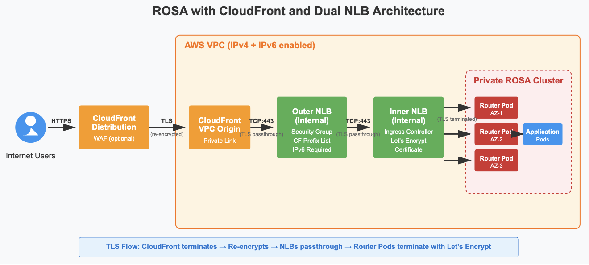
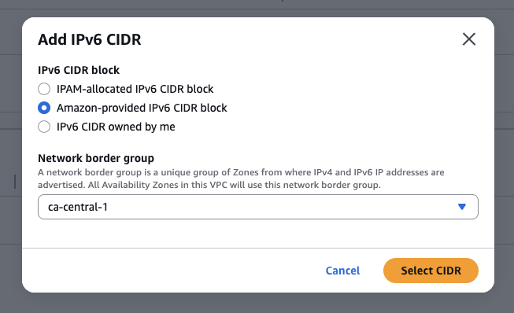
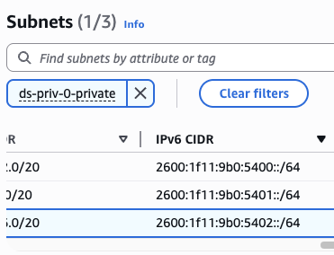
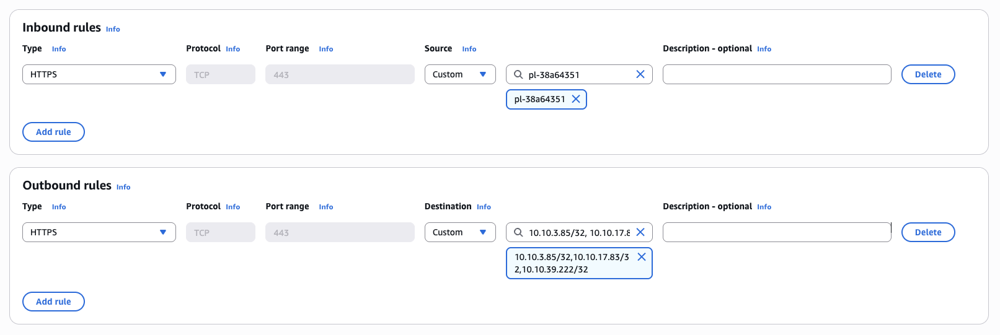
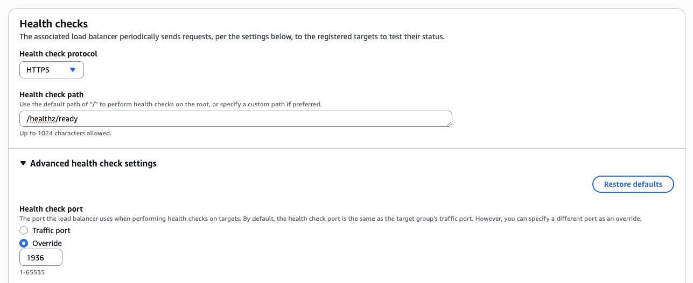
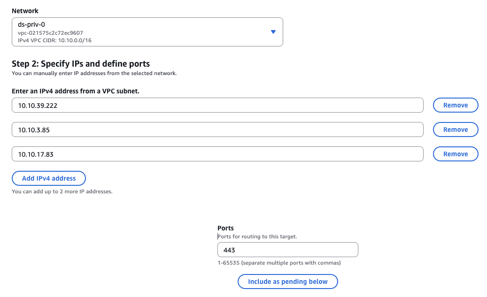
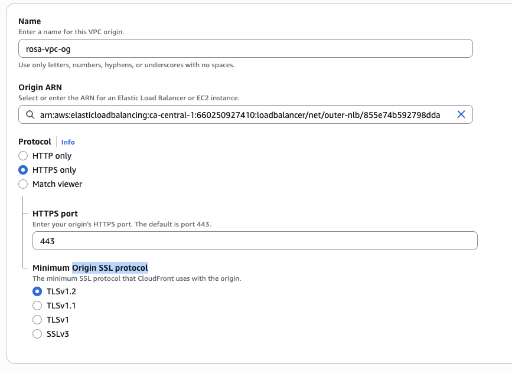
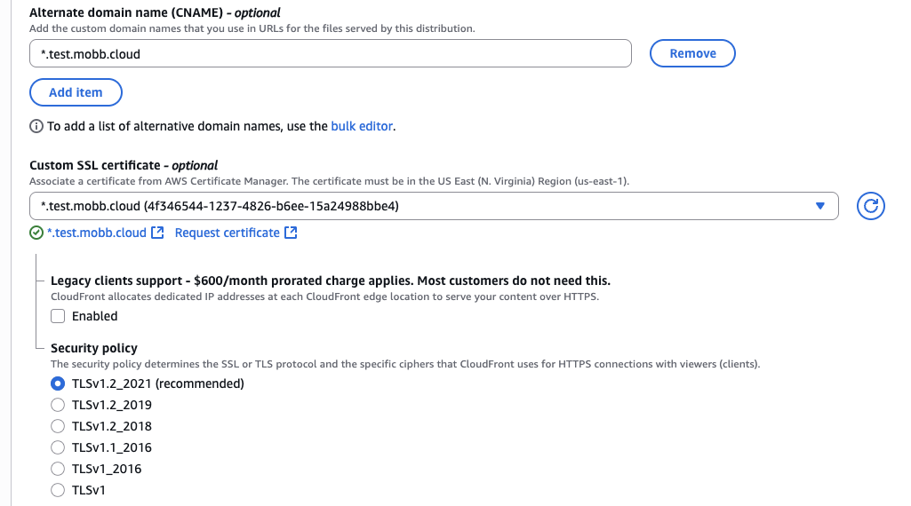

Starting with OpenShift 4.14, Red Hat OpenShift Service on AWS (ROSA) supports adding additional Ingress Controllers which can be used to configure a custom domain on a ROSA cluster. This guide shows how to leverage this feature to create a global routing solution with a CloudFront distribution, a VPC origin, an Network Load Balancer (NLB), and a private IngressController type NLB, providing a path from the internet to your applications.

In essence, the routing flow will look like this: Internet -> CloudFront Distribution -> CloudFront VPC Origin -> NLB (Outer NLB) -> Private IngressController (Inner NLB) -> Application. 


<br />


## 0. Why this Approach

This guide leverages CloudFront as a global content delivery network (CDN) and the architecture uses two NLBs - an outer NLB that receives traffic from CloudFront and an inner NLB that routes traffic to your ROSA applications. We also leverage OpenShift Routes and the built-in routing capabilities of the OpenShift platform. 

The primary reason for using two NLBs is mainly because when ROSA creates an NLB through an IngressController, it creates it without a security group, and security group cannot be attached after NLB creation. On the other hand, CloudFront VPC Origin uses a security group to restrict traffic to only CloudFront's managed prefix list, which means the NLB must have a security group, and hence the need for the second NLB.

By creating a secondary IngressController (type NLB), an NLB and placing a CloudFront in front of it, you can:

- Use standard OpenShift Route objects instead of managing NodePort Services or Ingress resources
- Avoid manually managing port allocations for multiple applications
- Attach AWS services like [Web Application Firewall (WAF)](https://aws.amazon.com/waf/). You could then use use [AWS Load Balancer Operator and Ingress and Routes](https://docs.redhat.com/en/documentation/red_hat_openshift_service_on_aws/4/html/tutorials/cloud-experts-using-alb-and-waf) rather than IngressController, or you can also use a [public IngressController](https://docs.redhat.com/en/documentation/red_hat_openshift_service_on_aws/4/html/tutorials/cloud-experts-using-cloudfront-and-waf) 
- Maintain compatibility with existing OpenShift deployment patterns

This approach is different from [adding Ingress Controller and ALB to ROSA guide](https://cloud.redhat.com/experts/rosa/private-ingress-controller-with-alb/) because instead of ALB, here we are adding NLB and fronting it with CloudFront acting as global CDN layer. In addition, the TLS handling in this guide is also different. Here, CloudFront terminates TLS from clients and re-encrypts traffic to the VPC Origin, the outer NLB then passes through TLS traffic without termination (Layer 4 load balancing), the inner NLB also passes through TLS traffic without termination, and finally, the router pods terminate TLS using the Let's Encrypt certificate configured on the IngressController. That said, there are no SNI (Server Name Indication) concerns because the NLBs operate at Layer 4 and simply forward the encrypted traffic. The OpenShift IngressController receives the full TLS handshake including SNI information, allowing it to route requests normally based on the hostname. This makes the architecture compatible with multi-domain routing while maintaining end-to-end encryption.


## 1. Prerequisites

* A private (or Privatelink) [classic](https://cloud.redhat.com/experts/rosa/terraform/classic/) or [HCP](https://cloud.redhat.com/experts/rosa/terraform/hcp/) multi-az ROSA cluster v4.14 and above.
* The oc CLI      # logged in.
* A Domain Name in a public zone. These instructions assume Route 53, but can be adapted for any other DNS.


## 2. Create a private IngressController (inner NLB)

Once you're logged into your cluster, please take a look at this [guide](https://cloud.redhat.com/experts/rosa/private-ingress-controller-with-alb/). From there, follow the step of **Create the Ingress Controller** to create the first NLB (let's call this **inner NLB**) and retrieve the IP addresses of your NLB. You can do so by following the first section of **Create the ALB** on that guide but please be sure not to continue creating the ALB since we are not going to do that here. Please keep these IP addresses handy as we are going to use it in the later steps.

## 3. Configure VPC for IPv6

Feel free to skip this step if you have already enabled IPv6 in your ROSA VPC. On the AWS console, go to VPC and select your ROSA VPC. Then on the upper right **Actions** button, click and select **Edit CIDRs** per snippet below. 


<br />

When prompted to new page, click the **Add new IPv6 CIDR** button. On the new prompt, choose  **Amazon-provided IPv6 CIDR block**, be sure you're in the right AZ (in this snippet below the cluster is located in `ca-central-1`), and then click **Select CIDR** button. 


<br />

It will then tells you that it successfully associated IPv6 CIDR. Click **Close**.

Then on the sidebar, click **Subnets**, and search for the three private subnets of your cluster. Pick one of the private subnets, click the **Action** button on top, click **Edit IPV6 CIDRs**, and then click **Add IPv6 CIDR**. Accept the auto-suggested CIDR blocks, but under **Subnet CIDR block**, click the down arrow to get **/64**, and hit the **Save** button. 


<br />

Replicate this step to the other two private subnets, but differentiate the last digit before the double semi colon for each subnets. See snippet below for an example.


<br />


## 4. Create a Network Load Balancer (outer NLB)

### 4.1. Create security group for outer NLB

Let's first create the security group for the second private ingress controller. On the AWS Console, go to **EC2**, select **Security Groups**, and then click **Create security group** button on the upper right side. 

Then on the new page, name the new security group `outer-nlb-sg` and provide description such as **allow cf to outer sg**, and select the VPC of your cluster.

Add inbound rule **HTTPS** with port **443**, **Custom** for source and search for **com.amazonaws.global.cloudfront.origin-facing**, which is the CloudFront managed prefix list. In my case per snippet below it returns **pl-38a64351**.

Then for outbound rule, also add **HTTPS** with port **443**, **Custom** for destination and include all three IP addresses of the inner NLB you've retrieved previously. 


<br />

And finally, click **Create security group** button on the lower right.


### 4.2. Create target group for outer NLB

Next, on the **EC2** sidebar, look for **Target Groups** and click it. Click **Create target group** button on the upper right side. On the new page, select **IP addresses** as target type, give it a name `outer-nlb-tg`, and choose protocol **TCP** with port **443**. Leave **IPv4** as IP address type, and select your cluster VPC as the VPC.

On the health check section, choose protocol **HTTPS** and then type in `/healthz/ready` for the health check path. Then click **Advanced health check settings**, and then under **Health check port** select **Override** and type in port `1936` underneath. 


<br />

Leave the rest advance settings as default. Then click the **Next** button at the end of the page. Once prompted to the new site, insert the three IP addresses of your inner NLB per snippet below. Leave the port to **443** and then click **Include as pending below** button.


<br />

On the **Review targets** section, be sure to check that all three IP addresses are in **Pending** health status. Click **Create target group** button.


### 4.3. Create outer NLB

Still on the **EC2** sidebar, click **Load Balancers**, and click **Create load balancer** button on the upper right corner. Select NLB as the type and hit the **Create** button.

On the creation page, name it `outer nlb`, select **Internal** as scheme, and leave the IP address type to **IPv4**. Under the **Network mapping** section, be sure to select your VPC, and select all the AZs and select the relevant private subnets for each. Then, under **Security groups**, add the security group, e.g. **outer-nlb-sg** that you created earlier.  


<br />

Under **Listeners and routing**, select protocol **TCP** on port **443**, and forward it to the target group, e.g. **outer-nlb-tg** that you created earlier.


<br />

Next, click **Create load balancer** button at the bottom of the page. It will take a couple of minutes for the status to turn from **Provisioning** to **Active**. Then, copy the **Load balancer ARN** as you would need it for the next step. 


## 5. Create CloudFront VPC Origin and Distribution

### 5.1. Create CloudFront VPC Origin

On the AWS console, look for **CloudFront**, and on the CloudFront sidebar select **VPC origins**, and then hit the **Create VPC origin** button on the upper right corner. Give it a name like `rosa-vpc-og` and paste the outer NLB ARN that you copied before for the **Origin ARN**. Choose **HTTPS only** for the protocol, leave the port ot **443** and the minimum origin SSL protocol to **TLSv1.2**. 


<br />

Hit **Create VPC origin** button at the end of the page, and wait for a few minutes until the status changed from **Deploying** to **Deployed**.


### 5.2. Create CloudFront Distribution

On the CloudFront sidebar, click **Distributions**, and hit **Create distribution** button on the upper right corner. Note that at the time of the writing, AWS actually just released a new UI for creating CloudFront distribution, however, this guide will show you how to create one using the previous/old one.

On the **Origin** section, under **Origin domain** look for the name of the VPC origin you created, e.g. `rosa-vpc-og`, select it and it will also auto-populate the VPC origin domain and the name below it. Leave the origin path to blanks and the rest of the origin settings to default.


<br />

On the **Default cache behavior** section, under the **Viewer** part, choose **Redirect HTTP to HTTPS** for viewer protocol policy, and select **GET, HEAD, OPTIONS, PUT, POST, PATCH, DELETE** for allowed HTTP methods.


<br />

Then under the **Cache key and origin requests**, select **CachingDisabled** for the cache policy, and choose **AllViewer** for the origin request policy. Leave the rest of the settings to default.


<br />

On the **Web Application Firewall (WAF)** section, select **Do not enable security protections**. Note that you can always enable WAF after you created the distribution later but we are not covering it here for the sake of simplicity. 

On the **Settings** section, under the alternate domain name (CNAME) part, click **Add item** button, and add your domain name there, along with the custom SSL certificate. See snippet below as an example. Leave the rest of the settings to default.


<br />

And finally, click the **Create distribution** button. And once it finished deploying, copy the **Distribution domain name** as you would need it for next step.


## 6. Create (or update) custom domain on Route 53 

Skip this creation step if you have already created the custom domain. To create one, go to your AWS Console. Select **Route 53** and choose a hosted zone, and from there, click **Create record** button. 

Here you will be creating a wildcard CNAME record (e.g. `*.test.mobb.cloud`) and point it to the CloudFront distribution domain name you just created, and click **Save**. 


<br />

If you have already the record previously, then simply paste/update the value to the CloudFront distribution.

FYI, now if you look at the target group you created earlier, you should see the NLB health checks are healthy.


<br />

## 7. Create Let's Encrypt certificate

Next, let's go back to CLI. Skip this step if you already have [Let's Encrypt Certificate](https://letsencrypt.org/). To create one, you would need to run certbot so please install it if you have not already (if you're a Mac user, you can run `brew install certbot`).

First, create following directories:

```bash
sudo mkdir -p ~/letsencrypt/{config,work,logs}
sudo mkdir -p ~/openshift-certs
```

Then run the following as sudo to generate wildcard certificate. Change the email address to your email address.

```bash
sudo certbot certonly \
  --manual \
  --preferred-challenges=dns \
  --email email@example.com \
  --server https://acme-v02.api.letsencrypt.org/directory \
  --agree-tos \
  --config-dir ~/letsencrypt/config \
  --work-dir ~/letsencrypt/work \
  --logs-dir ~/letsencrypt/logs \
  -d "*.$DOMAIN" \
  -d "$DOMAIN"   
```

It will then ask you to deploy a DNS TXT record under the name `_acme-challenge.YOUR-DOMAIN` with certain value provided by certbot. To do that, go to Route 53 and create a new record type TXT and point to that new value. Wait for a couple of minutes until it fully propagates. 

Open a new CLI tab and run either:

```bash
dig TXT _acme-challenge.$DOMAIN
``` 

Or:

```bash
nslookup -type=TXT _acme-challenge.$DOMAIN
```

And see if the value matches. If it matches, then go back to the tab where you run certbot command, and hit Enter. 

Once the certificate (**fullchain.pem**) and the key (**privkey.pem**) were successfully created, set the following permissions:

```bash
sudo chmod 700 ~/letsencrypt/config/live/$DOMAIN/
sudo chmod 600 ~/letsencrypt/config/live/$DOMAIN/privkey.pem
```

Then copy them for next step:

```bash
sudo cp ~/letsencrypt/config/live/$DOMAIN/fullchain.pem ~/openshift-certs/
sudo cp ~/letsencrypt/config/live/$DOMAIN/privkey.pem ~/openshift-certs/
sudo chown $(whoami):$(id -gn) ~/openshift-certs/*
chmod 644 ~/openshift-certs/fullchain.pem
chmod 600 ~/openshift-certs/privkey.pem
```

## 8. Configure certificate for inner NLB

Next, we are going to configure the certificate we created just now to the private ingress controller (inner NLB). To do that, let's first create a TLS secret:

```bash
oc create secret tls ingress-certs \
  --cert=$HOME/openshift-certs/fullchain.pem \
  --key=$HOME/openshift-certs/privkey.pem \
  -n openshift-ingress
```

Then, patch it to the NLB:

```bash
oc patch ingresscontroller $INGRESS_NAME \
  -n openshift-ingress-operator \
  --type=merge \
  --patch='{"spec":{"defaultCertificate":{"name":"ingress-certs"}}}'
```

Wait for a few minutes until the router pods restart:

```bash
oc get pods -n openshift-ingress -w | grep $INGRESS_NAME
```

## 9. Test an application

Finally, let's test this setup by creating a public application. Log in to the cluster to proceed with next steps.

1. Create a new project

   ```bash
   oc new-project my-public-app
   ```

1. Create a new application

   ```bash
   oc new-app --docker-image=docker.io/openshift/hello-openshift
   ```

1. Create a route for the application

   ```bash
   oc create route edge --service=hello-openshift hello-openshift-tls \
     --hostname hello.$DOMAIN
   ```

1. Check that you can access the application:

   ```bash
   curl https://hello.$DOMAIN
   ```

You should see the output `Hello OpenShift!`. Alternatively, go to your browser and access it from there.


<br />
